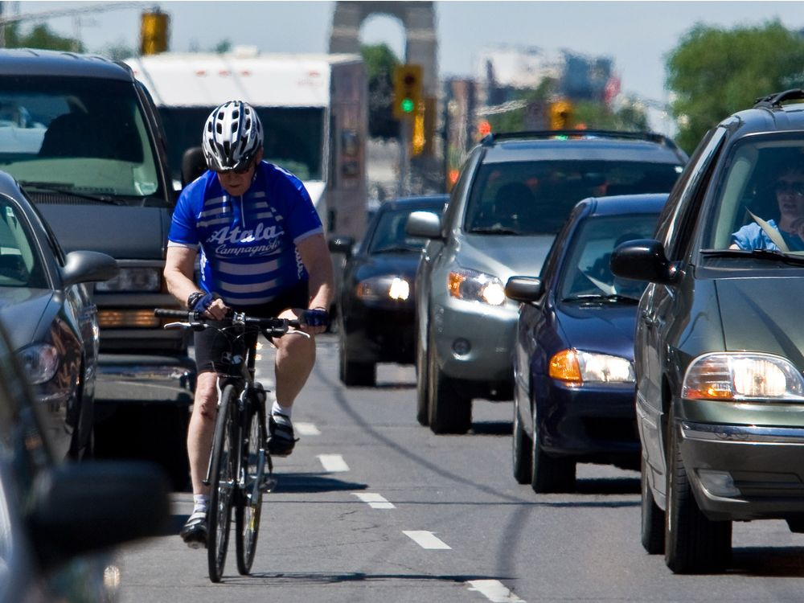
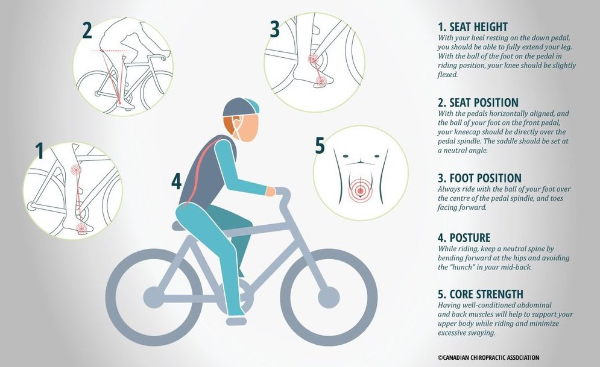

## Overview

Hey! Now that you're here, I'd like to start by telling you what this article's about: cycling to and fro from work. Recreational cycling, although similar, does have different motivations, so this article shall not venture there.  
Cycling has been popularised a lot recently, by a lot of sources. If perhaps you haven't decided for sure if you want to take it up, don't worry, this article will try clearing that up.  

## Why wouldn't I want to take it up?

If you're going to do it right, to be honest, it's not going to be cheap. Anything worthwhile is an investment, and that couldn't be more true in this case. So I wanted to dispel some of the doubts you might have about this, and set realistic expectations here.

1.  **Is it do-able?**

    Of course it is, but let me explain the question better. In order to cycle to and from work, you need to make sure of certain things, which I've mentioned below:

    1.  Be a realist about how fit you are. While cycling to work, you'd ideally not want to get totally drained just by the commute. So if the commute is far, say > 7-8 km, I'd suggest practising on the weekends, and cycling as part of your commute once you get used to it. It certainly helped me.  

        They forgot to mention our stamina in the phrase "like riding a bike". :)  

    2.  The above is mainly important because most long, city commutes, will have a distribution of upward and downward slopes. While the downward slopes can be fun, the upward slopes will be a little harder than anticipated.
    3.  If the city you reside in is humid, you're definitely going to need a shower at work, and a set of clothes to change.
2.  **How expensive is this going to be?**

    To be quite blunt, in India, it'll cost you about INR 20k - 30k/- depending on the type of bike you get. But again, as I mentioned earlier, it's an investment. Let's break it down:

    1.  If you don't own a car, using services like Uber/ Ola/ Rapido are the only alternatives. Although ride - sharing applications like quickride are useful, they hardly work even if you have a slightly dynamic work schedule, which I've found most people to have. Assuming you live within that 7-8 km radius I mentioned earlier, it'll take you about INR 300/- a day to commute. (depending on how far you live)  
        As you can see, you can recover the investment you made on your cycle in a little over 5 - 6 months, if you're regular.
    2.  If you do own a car, it might take you a little longer, but the economics here is compensated by opportunity costs.  
        Simply put, a 16 km round trip/ day would mean around 80 km/ week. Most decent cars would give around 15 km/ litre, and petrol costs slightly above INR 70/ litre. That's around INR 20k/ year.  
        The opportunity cost I mentioned earlier comes in the collateral health benefits of cycling regularly.  

    It costs this much only because you're investing in a good, geared, light bicycle. I'll get into the details you'll need to be aware of for buying one in the next article, but investing in this is necessary if you're going to stick to cycling. Making the experience pleasurable enough is extremely important for sustainability.

3.  **Is it dangerous?**

    Mostly, no. Being sensible enough in most situations is enough to keep you out of trouble.  
    I've been riding in the city for about 6 months, and not in a single situation have I felt unsafe. As long as you stay away from vigilantism and are sensible enough to give way to faster, more powerful vehicles, you'll be just fine.  
    I'd also like to mention that most of the accidents we hear about only happen because we cyclists think we're above road rules, like jumping signals and going in oncoming lanes. Adhering to traffic rules will work just fine.  

## Why would I want to take it up?

Now that we've seen the pessimist's approach, let's see the opportunist's.

1.  **Fitness & Health**

    I think this is pretty explicit. I expected myself to be tired, but on the contrary, I felt pretty energetic throughout my work day, and I wasn't irritable afterward, which used to happen before I started cycling.

2.  **Environment**

    It's environment friendly, if you're into that sort-of thing. Again, pretty explicit.

3.  **Traffic**

    

    If you live in a busy city with a poor traffic management system, this is the absolute best way to commute. I happen to live in such a city: Bangalore, India, and it gives me immense satisfaction to see the cars lined up, stuck in traffic as I whiz past them.

4.  **Social Status**

    It can be that quirk which sets you apart in your social circle. Not a lot of people commute by cycling, and the above mentioned factors are worthwhile things to be passionate about. :)  
    This reason is silly to the point of it being juvenile, but it got pointed out to me in the form of criticism, and I found some merit in it so I'm mentioning it here.  

## Weird things you need to know.

These are some weird useful things I've learnt, which might help you.

1.  **Posture**

    I learnt this the hard way. Posture is absolutely vital while cycling.

    1.  It increases efficiency. (you feel it's easier to climb inclines or go longer distances)
    2.  It eases your breathing.
    3.  It keeps you comfy.  

    You need to make sure your seat is slightly above the handle bar, and you're able to **almost** extend your leg while cycling.

    
    
2.  **Weather**

    If you live in a city where you don't always have clear skies, you'll have to plan your commutes a little. Always check when you're going to have rains in your area before you leave.  
    The best time to commute while cycling is **before** the rain, not during or after. During rains, it might hamper your ability to see, and if you're planning on cycling after, be prepared for dirty clothes and bags. Not to mention speeding vehicles douse you with puddle water.

3.  **Earphones**

    They're a necessity. I'm not crazy here, hear me out. In a busy bustling city, if you pay attention and turn around to every "HEY!" you hear, you're going to be cursing reading and being encouraged by this article. You need to filter some of it out, and the best way to do it is with earphones. **Do NOT** play loud music to block out all the ambient noise. I only listen to music at a very low volume, and/ or some podcasts, catching up with the daily news.  
    It's actually helped, and it does make the ride a lot more pleasurable.

## Bottomline
  
It doesn't need to be an immediate decision. Try it out. There are some apps like [Yulu](https://www.yulu.bike/), where you can rent a cycle for short periods of time, e.g. for a single commute, just to see if it's even possible. If you think it is, I'd recommend you invest in a proper cycle, and start reaping the benefits mentioned above. Standby for an upcoming article guiding you through what you need to look out for in setting yourself up.  

_Disclaimer: The above are the views of one person. They aren't intended to create controversy and the information provided is in no way accountable for the consequences sustained._