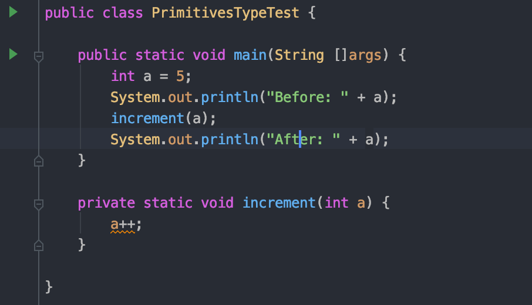
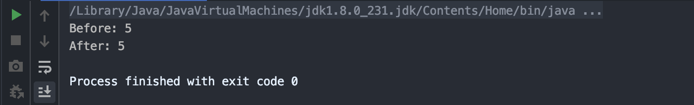
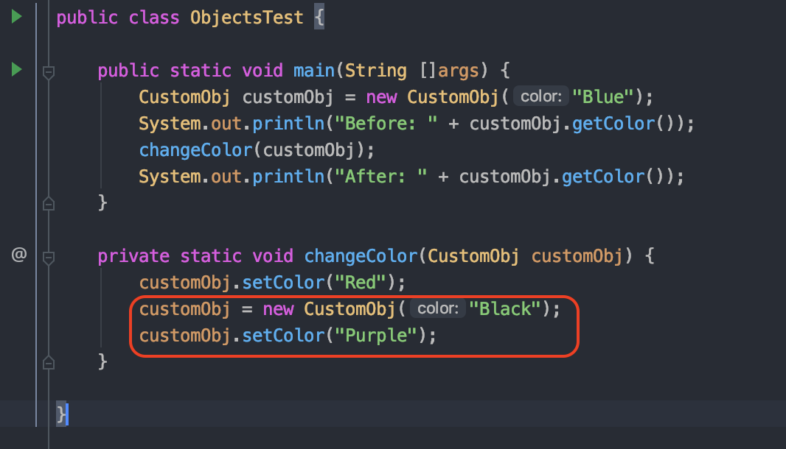
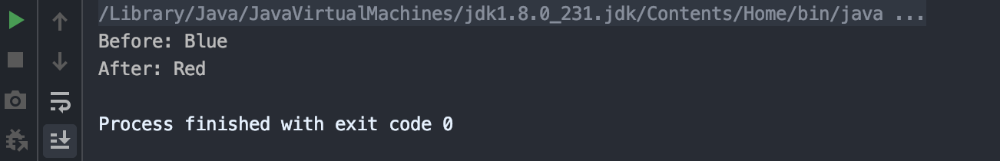
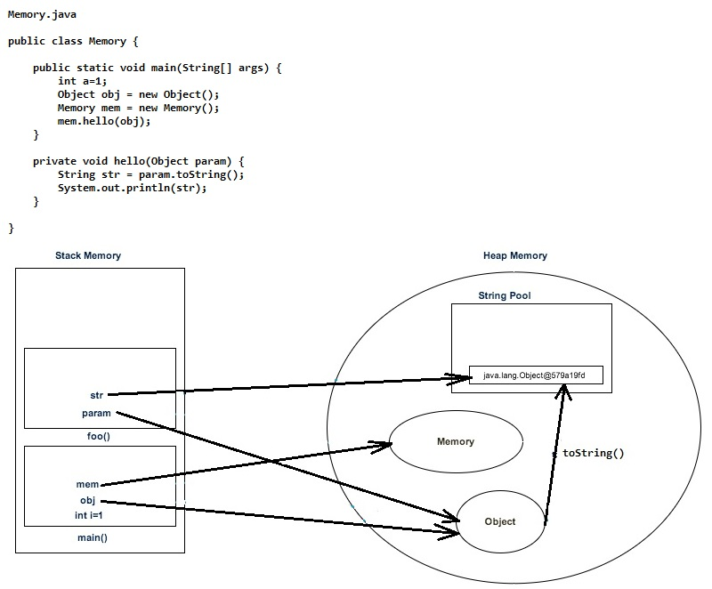

## Overview
I guess you're asking yourself why you, or anyone else for that matter, would spend much time on a question like this. I mean, this is the programming equivalent of whether Adam Sandler prefers baggy shorts or skinny jeans: Google will give you an answer, but the reasoning behind it would be quite abstract.  
The reason I even got into this question, is, like always, because of an argument. I was a little wary at first and was almost going to accept it and move on, but a tiny peek under the hood gave me so much information that I just couldn't stop looking.

## Bottomline

It's Pass-By-Value.  
Yep, Pass-By-Value is to Java what baggy pants are to Sandler. Why this is so confusing, and why this is such a big deal, I'll explain with an example.

## Recap

But first, let me recap what Pass-By-Value, and Pass-By-Reference actually means. They refer to function arguments.

### Pass-by-Value

If an argument is passed by value, it means that a copy of the original is passed into the function. This way, any modifications the function does to the argument, won't affect the original, since the argument in itself, is a copy.

### Pass-by-Reference

If an argument is passed by reference, you aren't actually sending the original value as an argument, you're sending it's **address**. What this means is any modification you do inside the function to the argument, you do it to the memory address you've passed, which means that the original is affected.

Given below is a pretty clean example of the above explanation.

       main() {
              int i = 10, j = 20;
              swapThemByVal(i, j);
              cout << i << "  " << j << endl;     // displays 10  20
              swapThemByRef(i, j);
              cout << i << "  " << j << endl;     // displays 20  10
              ...
           }

           void swapThemByVal(int num1, int num2) {
              int temp = num1;
              num1 = num2;
              num2 = temp;
           }

           void swapThemByRef(int& num1, int& num2) {
              int temp = num1;
              num1 = num2;
              num2 = temp;
           }

The above example is in C++. You'll notice how the function signatures of the Pass-by-Value and Pass-by-Reference functions are different. While `swapThemByVal` directly passes the value, `swapThemByRef` points to the memory addresses with '&' preceding the arguments.

## Let's get to the point

Imagine a scenario, where you only used the signature of `swapThemByVal`, but for some cases, the changes made inside the function, on the value "Passed-by-Value" reflected in the original. That would be confounding, wouldn't it?  
This is what happens in **Java**, and I've included examples below to prove it.

### Proof its Pass-by-Value: PrimitivesTypeTest

Here's the code snippet.

And here's the result derived. Notice that there's no difference between before and after the function is invoked, just like in `swapThemByVal`'s case.

### Proof its Pass-by-Reference: ObjectsTypeTest

Well, we proved above, that particular method signature in Java, means Pass-by-Value right? Apparently not. Behold, the exact same method signature.

And what do the results say? That the modifications inside the function, changed the original!  
Note: Don't pay attention to the red encircling just yet, we'll get to it in a minute.

It's quite puzzling, and truth be told, also worrisome if you dabble daily in huge code - bases of enterprise - level Java. That's why I decided to try and understand why.

## Under the hood

To understand this behaviour, its firstly essential to understand how memory is allocated to different components in Java.  
Java has 2 structures with the help of which it allocates memory, the stack, and the heap.

### Stack Memory

1.  Used for the execution of a thread. Contains method - specific values that are short - lived. E.g: Variables declared inside functions which die when their scope is finished have their memory allocated here.
2.  **Important: Stack memory contains references to objects in Heap Memory. These references are short lived. It also contains primitive objects local to the function.** If you're familiar with C, by references, I mean pointers. If you're not, the image below would make what I mean pretty clear.
3.  It's basically a Stack, so it's LIFO. (Last In, First Out) Whenever a new method is called, a new entry is made on the stack memory for it to hold method specific **local primitive values and references to other objects.**
4.  When the method's done, the entry becomes unused and becomes available for the next method.

### Heap Memory

1.  When an object is created, the memory is allocated from Heap, while the Stack memory holds the reference to it. This is pretty much the most important aspect, and is the main reason why these behaviours take place.

**Memory management in Java**

There's obviously a lot more to Stack and Heap Memory, especially the concept of **Garbage Collection**. (which I'll be covering in a later post)  
I've only listed the information pertinent to the post.

### What just happened?

Scroll back to my earlier example, ObjectsTypeTest and try correlating it with the above Memory management explanation.  
When the function `changeColor` was called, a new entry was made in Stack Memory. This new entry contained a **copied value of the reference** pointing to the object, customObj's memory in Heap.

*   **Essentially, the original reference (r1) to the object's (o1) memory in Heap was Passed-by-Value. This "Passed-by-Value" copy of r1 (let's call it r2) also pointed to o1's memory location.**

*   **So, when `customObj.setColor("Red")` was called, r2, pointing to o1 replaced the color "Blue" with "Red" in o1's Heap memory. When we get out of the function, we find r1 still points to o1, whose color is now "Red" thanks to r2.**

*   **This is why it tricks us into believing that customObj was Passed-by-Reference.**

This can be confirmed by the below code snippet (the red encircling in ObjectsTypeTest: I did tell you we'd get back to it) still resulting in the color to be changed to Red, not Purple. I've included the snippet again, below.

            customObj = new CustomObj("Black");
            customObj.setColor("Purple");

*   **Before we got into this portion, we had r1 -> o1\. When we got into the function, we had r1 -> o1, and r2 -> o1\. `customObj = new CustomObj("Black")` basically changed the rules, saying r2 -> o2 (a whole new object).**

*   **`customObj.setColor("Purple")` is still performed on r2, but it doesn't point to o1 anymore. Meaning when we get out of the function, and we display r1's color, it's "Red" due to r2's change while it still pointed to o1.**

*   **We basically assigned the new object (read as new memory space) to r2, and these changes did not reflect in r1, because, well, you guessed it, it was Passed-by-Value. :)**

* * *

I was a little satisfied after finally getting an explanation, and I hope you're feeling a little of the same. I've explained it in the most interesting yet informative way possible. If you still have questions, please reach out to me on any of the forums I've listed on my home page. :)

### References

1.  [Java Knowledge Base](http://java-know-base.blogspot.com/2016/02/java-memory-management.html)
2.  [Java: Oracle Docs](https://docs.oracle.com/javase/tutorial/)

Honestly, a whole bunch of Googling ending up in sites I don't remember helped a lot too.