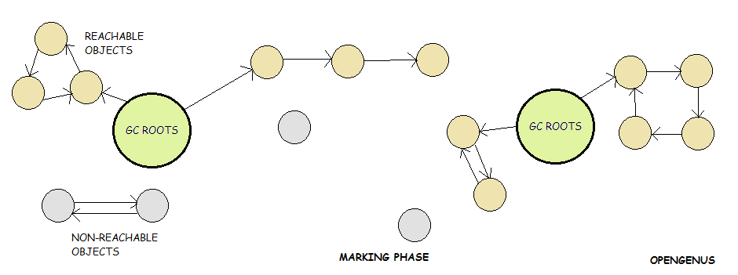
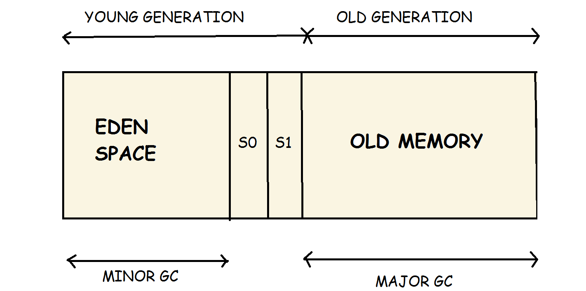
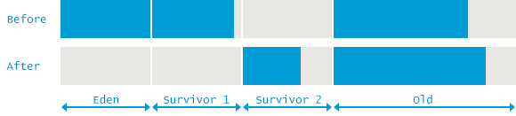
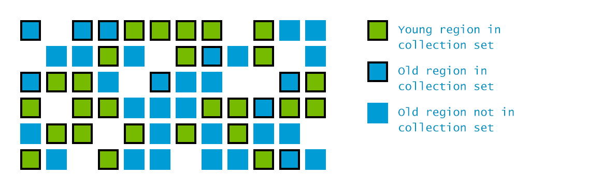

# Garbage Collection 101

## Overview

Garbage Collection **(GC)** is one of those topics we don't know the importance of, just because we haven't taken the time. It's used in all major enterprise programming languages and is an absolute necessity for scaling our applications.  
Why is this article important though? I mean, if GC's that important and someone went to the trouble of creating it in the first place, wouldn't they have programmed it pretty well? Moreover, the abstraction of its very concept should give us an assurance that our intervention is not really required.  
Well, "satisfying our curiosity" aside, knowing the underlying concept helps us write much better code, apart from optimising our systems as much as 30% across the board. Visit the last section of this article for some pretty self explanatory examples.  
Now that we've seen why understanding GC is important, let's dive deeper. In this article, we'll look at 3 things:

1.  **GC Basics**: Basically how a garbage collector works, and what happens when it's triggered.
2.  **GC Algorithms**: The different ways in which these garbage collectors have been implemented. These cover variations from trigger conditions to impacts on memory maps.
3.  **Choosing an Algorithm**: The different scenarios each algorithm caters to, and which GC is best suited for your needs.

## Garbage Collection: Basics

GCs do two things:

1.  Look through the entire Heap Memory and find out the objects which are still being used by the applications
2.  Delete all other entities from the Heap Memory; the supposedly dead and unused objects.

The first is called **Marking**, explained below.

### Marking

GC first defines some points in Heap Memory as **GC Roots**. These roots are of the following forms:

1.  The local variables in scope, along with the current executing method's input parameters.
2.  Context of active threads.
3.  References to Java Native Interface (JNI). Since GC mostly runs in languages compatible with Java's Virtual Machine (JVM), JNI is an interface between the machine's native operating system and JVM.
4.  Static fields of loaded classes.

The below image gives an accurate description of what happens in the mark phase.

Starting from the Roots, GC then traverses throughout all reachable objects in the Heap, marking them. These are termed as **live objects** or **survivors**. The objects which can't be reached are termed **Non-Reachable Objects** as can be seen in the image, and are the ones which will be **removed**, explained in the next section.

For the **Mark Phase** the application thread needs to be stopped, since GC can't operate on a base graph which keeps changing with time. This stop, is generally called a **safe point** leading to a **Stop-The-World (STW) event**.

### Throwing out Unmarked Objects

Different GC algorithms have different methods of dealing with the active memory after removing the unused objects. By extension these methods result in different Heap Memory patterns. They've been mentioned below:

#### Sweep

By far the simplest approach to GC. The memory spaces occupied by unused objects detected by the mark phase are considered to be free at the end of the Sweep, ready to be allocated to new objects.

Since the Heap Memory is left intact, memory locations of each of these "free regions" and its size needs to be recorded for future allocation, introducing an overhead. By extension, we can find another weakness: there can be a lot of free regions, but if none of them can accommodate an object, memory allocation is still going to fail. A failure of this kind is generally known as a **Fragmentation Fault**.

#### Compact

This approach basically looks at the Sweep algorithm and addresses it's shortcomings. **Mark-Sweep-Compact** moves all marked (alive) objects and allocates them contiguously, in the beginning of Heap Memory. This makes new allocation of memory fairly easy, since location of free space is always known, and there are no fragmentation issues either.

The downside, is GC latency. It's only logical that copying all these alive objects from their original memory locations into the beginning of Heap and deleting them from their previous location would take longer than just sweeping through them. Also, if GC is performed quite frequently, this could lead to higher Disk Utilisation.

#### Copy

Survivors are copied (relocated) to a new memory location, in most cases called "Survivor Space". The benefit with this method, is that copying can happen simultaneously while marking, with the main disadvantage being the need for an extra memory region, big enough to accommodate all the survivors from one mark phase.

## Garbage Collection: Algorithms

Now that we've talked about GC's basic components, let's look at the methods in which GC implements them. One essential concept here is the Generational Heap Memory, explained below.

### Generational Memory

1.  **Eden Space**: This is where all new objects are allocated memory. **Minor GC** (explained later) runs in this region.

2.  **S0, S1**: Both these are collective Survivor Space: Survivor Space 1 and Survivor Space 2\. Objects are copied here from Eden Space after they're marked to be live objects in algorithms like Mark-Sweep-Copy.

    Eden Space, S0, S1 are collectively called Young Generation.

3.  **Old Memory**: Objects which are marked to be "alive" through multiple cycles of GC's mark phase are copied and relocated into the old memory, or the **Tenured Generation**. This is the memory region **Major GC** (explained later) runs in.

The below mentioned GCs are extremely complex. I'll only be giving one-liner definitions, along with some key differences. We'll delve deeper in the **Which Implementation Should I Pick** section. However, details of their exact implementation can be found [here](https://plumbr.io/handbook/garbage-collection-algorithms-implementations).

Terminology wise, a **Full GC** cycle is one in which both Minor and Major GC run.

### Serial GC

1.  **Minor GC**: Uses Mark-Copy for the Young Generation.

4.  **Major GC**: Uses Mark-Sweep-Compact for the Old Generation.

As the name implies, these are single threaded collectors, triggering stow-the-world pauses, stopping all application threads.

### Parallel GC (Throughput GC)

Exactly similar Minor and Major GC implementations as Serial GC, with the exception that this can handle Multi - Core systems with ease. Below is an image depicting a Full GC. (Minor + Major)

1.  All cores run GC cycles (Minor or Major) concurrently, leading to shorter pauses.
2.  No core's GC consumes any resources in between 2 cycles.

### Concurrent Mark & Sweep (CMS)

It should be called Mostly Concurrent* but I won't nit - pick.

1.  **Minor GC**: Uses parallel STW Mark-Copy.
2.  **Major GC**: Uses mostly concurrent Mark-Sweep.

Designed to avoid long pauses compacting the Old Generation. As explained before, it uses free - lists to keep track of free regions and their sizes in the Tenured Generation Heap. It **mostly** does the Mark-Sweep concurrently, only using 1/4th of the machine's available thread resources by default.

### G1 (Garbage First)

Latest innovation by Oracle which tosses the Generational Memory Model out the window.

1.  The entire Heap is divided into a number of (typically 2048) smaller regions. Mark Phase runs **concurrently** when the overall occupancy of the heap is large enough, 45% by default, finding regions of maximum garbage.
2.  Sweep then goes after only these regions, tackling other regions iteratively. It also has dedicated threads continuously working on reducing **Fragmentation**.

There is a lot more complexity as to how it's implemented, and why it's only mostly concurrent. Please refer to the link above to get more clarity.

## Which one should I pick?

For most cases, my suggestion is to let JVM choose your collector. But, if you believe the default collector is not helping,

1.  Serial GC: If your situation is a Single CPU Server. Command Line Option should be -XX:+UseSerialGC
2.  Parallel GC: Should cater to most your needs where **throughput** is most important, and GC Pause times ~ 1 Second are O.K. Command Line Option should be -XX+UseParallelGC
3.  CMS/ G1 GC: If your application can't tolerate long GC pause times. But your application should be able to afford a higher amount of Heap, and it should be comparitively powerful with multiple cores/ threads.
    1.  Command Line Option for CMS should be -XX:+UseParNewGC -XX:+UseConcMarkSweepGC
    2.  Command Line Option for G1 should be -XX:+UseG1GC

Most of you must've heard of [Twitch](https://www.twitch.tv/), the online videogame streaming platform right? By tuning their GC, they **reduced their API latency by 45%, and increased CPU Utilisation by 30%.** . Just to make it's relevance clear, let me reiterate that by industry standards these are **huge** margins. Improving CPU Utilisation by 30% directly allows savings of 30% in server costs. Find out how they did it [here](https://blog.twitch.tv/en/2019/04/10/go-memory-ballast-how-i-learnt-to-stop-worrying-and-love-the-heap-26c2462549a2/).

## Finally, just why is all this so important?

**Something we should keep in mind before going forward, is that GC, Heap Memory, CPU Utilisation, and Disk Utilisation are processes and entities which are inexplicably linked in a system.**

These links are pretty complex, but I'll try to capture some of them here.

1.  **Frequency of GC is inversely proportional to CPU Utilisation**:  
    Pretty self explanatory, GCs are complex memory-heavy applications, which, if run frequently and unnecessarily, hog a lot of CPU cycles, leaving the target application lesser ones to be utilised.
2.  **Frequency of GC is inversely proportional to Latency**:  
    All GCs are STW events to some degree, even the concurrent ones. This should by extension lead to the "no-brainer" realisation, that higher the frequency, the more time that gets spent in the application waiting around for the GC to clear the Heap Memory.
3.  **Size of active Heap Memory is proportional to GC Latency**:  
    The higher the size of active heap memory, the more the GC has to dig through to find which memory spaces are still "relevant".
4.  **Frequency of GC is proportional to Disk Utilisation**:  

    1.  A normally/ poorly configured GC writes a lot of information in its logs. Mind you, certain systems give rise to a poorly configured GC by default. In these cases, tuning the GC is paramount. If the GC keeps getting unnecessarily fired, due to the inanely high amount of reads/ writes, Disk Utilisation by the system shoots up, leaving less room for the application's CPU Utilisation.
    2.  If the GC employs Mark-Sweep-Compact, rewriting active objects while compacting would also contribute to Disk Utilisation.

The above are just the most prevalent relationships amongst the entities mentioned. I hope this gives an idea as to why tuning GCs are important. The subsequent article will show us how to look for clues as to whether or not we **need** to tune our GC.

**Note: None of the above concepts are associated with just Java. They are applicable for any and all programming languages which can be run in Java's Virtual Machine (JVM). Typical examples of this would include Kotlin, Clojure, Scala, Ruby, Groovy, etc.**

## References

Most of this is just me reading up different sources on the internet and jotting the essentials down.

1.  [Plumbr.io Docs](https://plumbr.io/handbook/)
2.  [Java: Oracle Docs](https://www.oracle.com/webfolder/technetwork/tutorials/obe/java/gc01/index.html)
3.  [Karun Subramaniam](http://karunsubramanian.com/websphere/how-to-choose-the-correct-garbage-collector-java-generational-heap-and-garbage-collection-explained/)

Honestly, a whole bunch of Googling ending up in sites I don't remember helped a lot too.