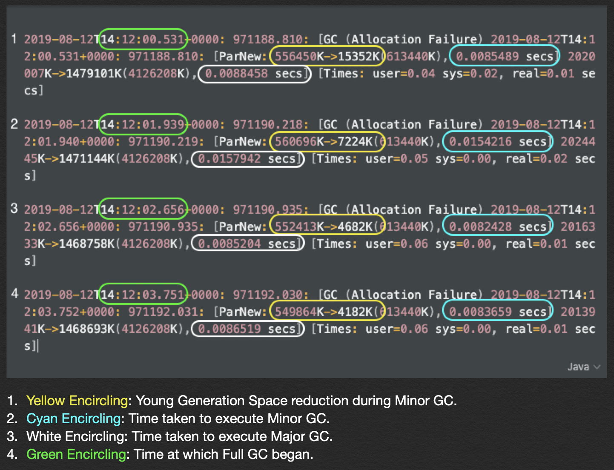
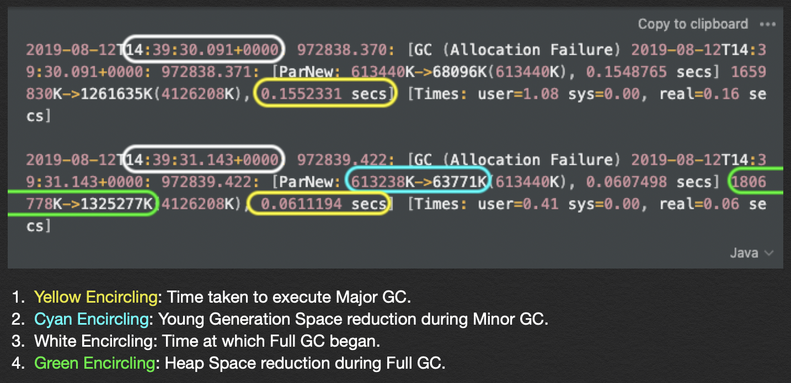

**Disclaimer: While the last [article](https://adi10197.github.io/articles/garbage-collection-101) was generic, this one 
might be a little technical. I've majorly focused on the Java Virtual Machine and the Java Development Kit. I've 
included links to explanatory articles wherever possible.**
 
## Bottomline
The below advice comes from a lot of research, and from engineers much more experienced and qualified than I am: 

**Migrate your service to G1 GC as soon as possible.**

Though this article will explain all the different parameters of a service which should be taken into while tuning its 
GC, and methods of monitoring the fine tuning, all this isn't necessary if G1 GC is used. Also, JDK9 comes with it as 
default, and migration isn't that troublesome.  

## Understanding Services

The decision to undertake any action is always measured on its return on investment (ROI). Understanding the service
you're migrating is essential, since this gives you an idea on tuning parameters, more of which we'll cover later in 
this article. 

### Service Level Agreement (SLAs)

The parameteres on which an SLA is built can range from throttling limits to service latencies. Service Latency is an 
important parameter to assess here, since Timeout Errors (504) and by extension, Overload Errors (503) can be caused by 
an incorrectly configured GC pause time. (To understand what GC pause is, please read through my earlier 
[article](https://adi10197.github.io/articles/garbage-collection-101). 

The latency SLA would mainly affect the tuning parameter: -XX:MaxGCPauseMillis.

### Allocation Rates

It's important to understand Allocation Rates since it directly affects how you tune your GC, and the hardware you use.
We'll only understand the concept and its impact here. Analysing GC logs and interpreting allocation rates will be 
covered in a later section.

Allocation rate is measured in the amount of heap memory allocated per time unit. If your allocation rate is high, it
provides a **threat to latency since GC cycles are triggered more frequently**.

In extreme cases, the services face OutOfMemory Errors when the hardware isn't able to handle the allocation rate. This
generally doesn't happen, since most commodity hardware can handle at least 1 GB/sec/core (higher than the allocation 
rates of general purpose services).

Since we've ruled the hardware threat out, we look more closely at GC cycles being the bottleneck. Two facts are 
noteworthy here:

1. Allocation rate affects only Minor GC (cleaning the young generation), not Major GC. This makes sense as allocation 
is only done in Eden Space. Objects are only promoted to Tenured Gen after surviving multiple cycles in Eden and Survivor 
Spaces.
2. We then focus on the Eden Space. It's only logical, that if the size of Eden Space is increased, the Minor GC will 
have to run less frequently, which results in reduced latency due to application threads being stopped for GC less
frequently.

Note: It would seem here, like an increase allocation rate would mean more service throughput, but we also need to take 
Major GC into consideration. Service throughput should therefore be measured in the business operations your service 
provides.

For CMS/ Parallel GCs, we'd need to monitor the actual allocation rates to tune it, while in G1 GC, we just need to 
understand the boundary of allocation rate as we'll understand later.

### Promotion Rates

Logically, promotion rates directly impact GC pauses. If promotion rates are high, the faster Old Generation fills, 
which leads to Full GC getting triggered more frequently, leading to higher latency.

**Promotion Rate therefore affects Major GC, as opposed to Allocation Rates, which affect Minor GCs.**

Higher promotion rates lead to something known as **premature promotion**, which happens when objects having low life 
expectancy get promoted into Old Generation, thus becoming the responsibility of Major GC to clean, leading to an 
undesirable state.

A symptom of premature promotion is when promotion rates approach allocation rates. Ideally, promotion rates should be 
lower.

The fixes for such cases are always application and resource specific. It could have an easy fix in that you could just
increase the size of Young Generation, but in doing so, you would increase the frequency of Minor GCs. This would 
require extensive testing to gauge a balance between the two, which is why **this article advocates the shift to G1 GC,
which automatically tunes these parameters most of the time.**

## Logging & Monitoring

In order to even identify if migration into G1 GC is required, GC Logs need to be enabled, interpreted and  and monitored. 
Please make sure you have atleast 200MB disk space for GC logs.

### Enabling GC Logs

#### JDK8
To enable GC logs and enable GC log rotation, the JVM configuration needs the following parameters:
```
-Xloggc:$ENVIRONMENT_ROOT$/var/output/logs/garbage-collection.log -XX:+UseGCLogFileRotation -XX:GCLogFileSize=10M
 -XX:NumberOfGCLogFiles=20
```

To make sure there are enough details for effecting monitoring/ debugging purpose, include the following parameters in 
the same configuration:
```
-XX:+PrintGCDetails -XX:+PrintGCTimeStamps -XX:+PrintGCDateStamps -XX:+PrintTenuringDistribution -XX:+PrintGCCause 
-XX:+PrintHeapAtGC -XX:+PrintAdaptiveSizePolicy -XX:+UnlockDiagnosticVMOptions -XX:+G1SummarizeRSetStats 
-XX:G1SummarizeRSetStatsPeriod=1
```

#### JDK11: G1 GC is set by default
JDK11 has [Unified GC Logging](https://openjdk.java.net/jeps/271), which is easier to set up:
```
-Xlog:gc*=debug:file=$_ENVIRONMENT_ROOT$/var/output/logs/garbage-collection.log::filecount=20,filesize=10m
```

We'll delve into each of these parameters while explaining GC tuning.

### Interpreting GC Logs

#### Calculating Allocation Rate



Above are 4 Full GC Events. Since allocation rates are only dependant on young generation space, we'll only be 
considering Minor GCs. Notice how these GCs are only triggered on Allocation Failures.

The calculation explained below isn't entirely accurate, but it does give an indication and a reasonable estimation for 
the purposes of this exercise. 

Allocation Rates are defined as the space allocated/ time taken. Since they differ with each cycle, averaging them out 
over 4 events seems beneficial.

Therefore, you'll observe that the total space **allocated** in the young generation during Minor GC is:
```
(560696K - 15352K) + (552413K - 7224K) + (549864K - 4682K) = 1635715K
```

And the time taken for the above is:
```
(14:12:03.751 + 0.0086519) - (14:12:00.532 + 0.0088458) = 3.219 seconds
```

Which brings us to the allocation rate being:
```
Space Allocated/ Time Elapsed: 1635715K / 3.219 = 508,144 K/s
```

#### Calculating Promotion Rate

**Promotion** here means moving data to more tenured generations in the Memory Generational Model of GC consisting of 
Eden Space, Survivor Space, and Old Memory. By extension, Promotion Rate is defined as the data propogated from Young to 
Old Generation per time unit. 

Therefore, it can be calculated from the logs with the following logical formula:

[(Data decreased by Minor GC) - (Data decreased by Full GC)] / (Time taken for Full GC).



Calculating the individual components of the formula given above, 

You'll observe the promotion amount is
```
(613,238K - 63,771K) - (1,806,778K - 1,325,277K) = 67,966K
```

and the time taken is
```
((31.143 + 0.061) - (30.091 + 0.155)) = 0.958s
```

which leads to the Promotion Rate being
```
67,966K / 0.958s = 70,946 K/s ~= 71 Mb/s.
```


## The Tenets of GC Tuning

This section is just going to mention the utopian, idealistic scenario. These tenets should be strived toward while 
tuning, and G1 GC does exactly this.

1. Short lived objects must stay in Young Generation long enough to die there.
2. Young Generation must be big enoguh to absorb transaction spikes.
   1. This is hardly ever the case, because this "spike" size is always unpredictable. Short lived objects leak into Old
   generation due to this, making an unnecessarily long Full GC inevitable.
3. In the absolute worst case, we'd have to work with fixed size generations. Here,
   1. A larger Young Generation leads to longer time between pauses, meaning the application threads have more time to 
   execute application essential functions without the systems Garbage Collection threads interrupting.
   2. A larger Tenured Generation leads to longer pauses. This is **not** desirable because it would lead to higher latency 
   "no amount of memory is memory enough" anyway.

Static tuning never leads to an efficient system. The 3rd point above is just the tip of the iceberg. Collectors should
be dynamically self tuning in that they dynamically vary generational sizes and collect the Tenured Generation 
incrementally to avoid Full GCs. This is hardly the case, except for G1 GC :).

## G1 GC

### Should I migrate to G1 GC?

This section covers the motivation behind wanting to shift to G1 GC. The general rule of thumb is that G1 GC is 
inherently better for general purpose business applications/ services. Explicitly having the requirement to use CMS/
Parallel GC would require extensive tuning and knowledge, and let's face it, you wouldn't be here if that were the case. :)

You should NOT migrate to G1 GC if:
1. If your application/ service depends more on throughput than latency. If so, choose Parallel/ CMS GC, as the 
individual pause impact might be higher, but the overall GC impact on throughput might be lower while sacrificing latency.
2. If your application/ service depends on frequently allocating contiguous humongous objects in the Eden Space. These 
humongous objects are dealt with by CMS/ Parallel GC better by default. There's a way for G1 GC to handle them better, 
but that's complex enough for it to be the topic for a separate article altogether.

Migrate to G1 GC if:
1. Lesser SDE effort is preferred to be spent in optimising these algorithms:
   1. G1 GC adapts itself based on the pause timing set with argument: (-XX:MaxGCPauseMillis).
   2. G1 GC is more intuitive with lesser parameters as compared to CMS/ Parallel GCs.
2. Lower Old Generation impact: G1 is garbage first, and so it collects Old Gen spaces with most garbage first and
leaves the regions with live objects alone.  

### Enable G1

Enabling G1 GC is easy. We just need to make sure we remove Parallel and CMS GC and add G1 GC to the JVM configuration.

For example, **remove**
```
-XX:+UseConcMarkSweepGC
```
and add
```
-XX:+UseG1GC
```

Note: JVM will not start if both CMS and G1 are present in the configuration.

### G1 GC Tuning

#### Basic

Firstly, G1 doesn't like to be tuned by you. Throw out your old heap config switches, and just specify the bare minimum.

1. Give G1 a maximum heap size with
```
-Xmx –Xms
```

2. And a pause time goal, as required by your application or service's latency SLA/ goals:
```
-XX:MaxGCPauseMills=
```

If you run into issues, the first thing to try is to try increasing maximum heap size.

#### Advanced: Common FAQs

**Caution: In general, do not attempt to tune G1 GC unless you know for sure what you're doing.**

* **"I've tuned it with heap size and pause target, but the Young collection pause times are still a bit too long. 
Is there a quick way to fix it?"**

   **Answer**: You can look at the number of threads for Younger Generation collections. The number is defined with the 
   below equation when the host has more than 8 cores by default. We can set it to a required number, but we need to 
   keep the following in mind:
   1. It does not make sense if this number is higher than the logical CPU cores.
   2. Are all hosts in the fleet and across regions having the same number of CPU cores?
   3. Once you set this number, you would have to continue updating it while moving to hosts with higher CPU counts. 
   Otherwise it would block JVM from utilizing new hardware.
   4. Consider other applications/ services running on the same host.
```
-XX:ParallelGCThreads = 8 + ((N - 8) * 5 / 8) 
```  

*  **"The Young space usage is mostly at 5%. The promotion rate is high and Object Copying cost is high in GC logs."**
   
   **Answer**: By default, the range of Young gen capacity in G1 is between 5% (-XX:G1NewSizePercent) and 60% 
   (-XX:G1MaxNewSizePercent). When G1 could not meet the pause target (-XX:MaxGCPauseMillis), it would try to reduce 
   Young gen size to achieve the target since smaller Young gen size would mean quicker collection time. Smaller Young 
   gen capacity also make Young collection more frequent, which could drive up promotion rate and Object Copying.
   
   1. You can try fixing this by increasing the value of -XX:G1NewSizePercent to make sure Young Generational Usage
   Capacity won't go below the number.
   2. You need to first set -XX:+UnlockExperimentalVMOptions before you can set -XX:G1NewSizePercent. (It gets serious
   here, so only enable this if you absolutely know what you're doing, or if you're using this in an experimental
   capacity. Deep diving and root causing the repercussions might be a monumental task.

## References

Most of this is just me reading up different sources on the internet and jotting the essentials down.

1.  [Plumbr.io Docs](https://plumbr.io/handbook/)
2.  Discussions with peers and Senior Devs @ Amazon.

Honestly, a whole bunch of Googling ending up in sites I don't remember helped a lot too.

I really hope this helped. Garbage collection is an enigma, and I'm myself in no way an expert. Reading about this is 
really fun, and I thought I'd share the essentials of what I've learnt. :)
