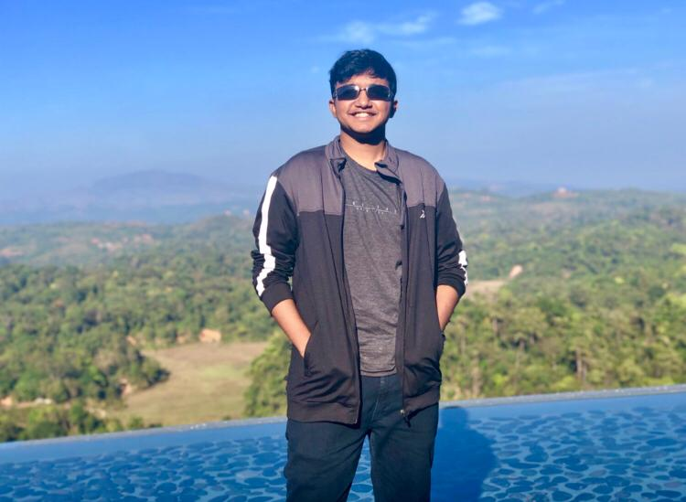

# **About Me**

    

Hey, I'm **{{ site.author.name }}**. 

I hail from Tamil Nadu, a region in the southern part of the Indian subcontinent. I'm a Computer Engineer, having 
recently graduated from BITS Pilani, India. Currently working as a Software Engineer at 
[Amazon](https://www.aboutamazon.com/). I try to learn tools and implement methods which create simple solutions to 
complex issues, and I've created this page, and the blog below as a hope of documenting them. Apart from programming, 
I follow F1, listen to, and occasionally create music, and write at times.



